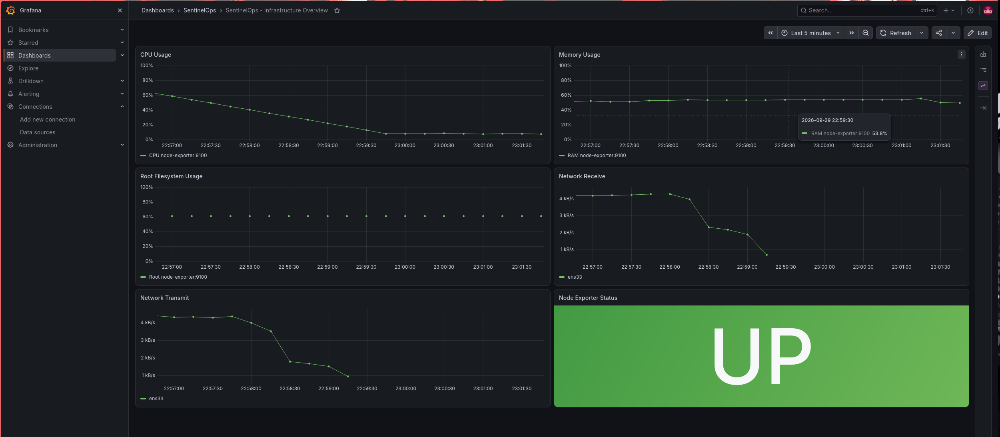
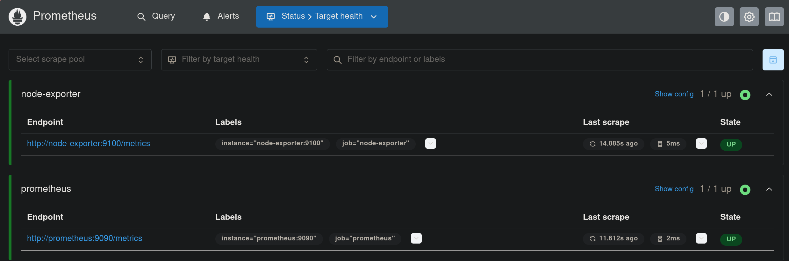
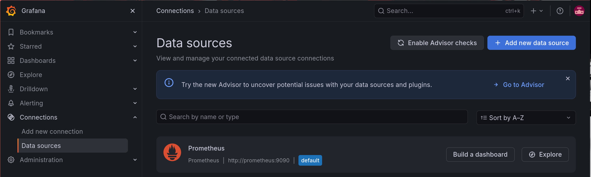

# 🔴 SENTINELOPS

### Linux Infrastructure Observability Lab

**See the system. Understand the signal.**

A reproducible, self-hosted Linux monitoring lab built with Docker Compose, Prometheus, Grafana and Node Exporter.

[](compose.yaml) [](prometheus/prometheus.yml) [](grafana/)

[🇪🇸 Español](README.es.md) · [Architecture](#-architecture) · [Quick start](#-quick-start) · [Security](#-security)

---

## ◈ Mission

SentinelOps provides centralized visibility into a Linux host. Node Exporter exposes host metrics, Prometheus collects and stores them, and Grafana presents them in a dashboard provisioned from version-controlled configuration.

> **Project type:** Personal educational lab · **Deployment:** Docker Compose · **Focus:** Linux, observability and infrastructure operations

## ◈ Capabilities

| Area | Implementation |
|---|---|
| Host telemetry | CPU, RAM, filesystem and network |
| Collection | Prometheus · 15-second scrape interval |
| Visualization | Grafana dashboard provisioned from JSON |
| Persistence | Named Docker volumes |
| Network exposure | Grafana and Prometheus bound to `127.0.0.1` |
| Container hardening | Node Exporter read-only filesystem, dropped capabilities, `no-new-privileges` |
| Configuration | YAML and environment-based Grafana admin password |

## ◈ Dashboard

<div align="center">



*Host-level metrics presented in one Grafana view.*

</div>

### Operational evidence

| Prometheus targets | Grafana data source |
|---|---|
|  |  |

## ◈ Architecture

```text
                         LINUX HOST
                             │
                       DOCKER COMPOSE
                             │
                  monitoring bridge network
              ┌──────────────┼──────────────┐
              │              │              │
         Prometheus        Grafana     Node Exporter
           :9090            :3000          :9100
              │              ▲              │
              └── metrics ───┘         host metrics
                             │
                    provisioned dashboard
```

## ◈ Quick start

### Requirements
- Linux host with Docker Engine and Docker Compose
- Git
- Local ports `3000` and `9090` available

### 1 — Clone
```bash
git clone https://github.com/KyyroxxX/SentinelOps.git
cd SentinelOps
```

### 2 — Configure credentials
```bash
cp .env.example .env
```
Edit `.env` and set a strong, unique Grafana administrator password. Never commit `.env`.

### 3 — Validate and launch
```bash
docker compose config -q
docker compose up -d
docker compose ps
```

### 4 — Open the services
| Service | Local address | Authentication |
|---|---|---|
| Grafana | [localhost:3000](http://localhost:3000) | `admin` / password from `.env` |
| Prometheus | [localhost:9090](http://localhost:9090) | No authentication configured |

## ◈ Repository map
```text
SentinelOps/
├── compose.yaml
├── prometheus/prometheus.yml
├── grafana/
│   ├── dashboards/sentinelops.json
│   └── provisioning/
├── screenshots/
├── .env.example
├── .gitignore
├── README.md
└── README.es.md
```

## ◈ Operator commands
| Task | Command |
|---|---|
| Service status | `docker compose ps` |
| Follow logs | `docker compose logs -f` |
| Restart services | `docker compose restart` |
| Stop, retain data | `docker compose down` |
| Validate Compose | `docker compose config -q` |

To remove persistent data too, run `docker compose down -v`. **This deletes named volume data.**

## ◈ Configuration
- Prometheus config: `prometheus/prometheus.yml`
- Scrape/evaluation interval: 15 seconds
- Data retention: 7 days
- Dashboard source: `grafana/dashboards/sentinelops.json`
- Dashboard is file-provisioned; edit its JSON source in Git.
- Grafana and Prometheus are published on loopback only.

## ◈ Security
- Keep `.env` private; use `.env.example` for placeholders.
- Web interfaces are intended for local access, not direct public exposure.
- Node Exporter requires host visibility to collect metrics. Review its mounts and permissions before adapting the setup.
- This is a learning lab, **not a production-hardened monitoring platform**.

## ◈ Roadmap
- [x] Docker Compose monitoring stack
- [x] Prometheus collection and Grafana provisioning
- [x] Persistent metrics and dashboard data
- [x] Localhost-only web interfaces
- [x] Setup documentation and screenshots
- [ ] CI validation for Compose and configuration files
- [ ] Reproducible demo walkthrough
- [ ] Alerting rules and documented test cases

---

<div align="center">

**Built by [KyyroxxX](https://github.com/KyyroxxX)**  
Linux · Infrastructure · Observability

<sub>Learn by building. Measure what matters.</sub>

</div>
